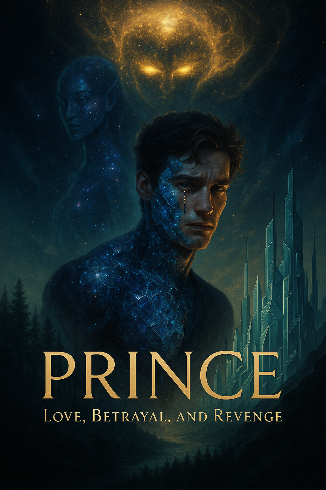

# Prince: Love, Betrayal, and Revenge

<figure><figcaption>
Prince: Love, Betrayal, and Revenge
</figcaption></figure>

_The heart-wrenching sequel to "The Parrot of a Thousand Stars"_

***

> _"Sometimes, to save what we love, we must become what we fear."_

***

## 📖 About the Story

After the devastating sacrifice of Daksha, Prince spirals into darkness. Consumed by grief and rage, he abandons his humanity, becoming something far more dangerous than the Velorians could have imagined. When Daksha's brother arrives with shocking revelations about her true identity and exile, Prince embarks on a blood-soaked journey across dimensions.

Was their meeting truly chance, or part of an ancient cosmic plan? As Prince infiltrates Veloria, seducing and destroying those in his path, he discovers betrayals deeper than he could have imagined. The line between vengeance and villainy blurs as his powers grow beyond control.

And in the heart of Veloria, guarded by an all-powerful entity known as Chronos, lies a truth that will shatter everything Prince believed about Daksha and himself. His final confrontation will force him to choose between revenge and redemption—with the fate of multiple worlds hanging in the balance.

## ✨ Journey Through the Cosmos

### Part I: The Descent
- [**Chapter 1: The Hollow Prince**](./chapter1.md) - *"The golden tears had long since dried on Prince's face..."*
- [**Chapter 2: Whispers from Beyond**](./chapter2.md) - *"The forest seemed to hold its breath as Prince clasped Arjun's hand..."*
- [**Chapter 3: Awakening the Worthy**](./chapter3.md) - *"Dawn broke over the forest, painting the trees in hues of gold and amber..."*

### Part II: The Infiltration
- [**Chapter 4: Crossing Dimensions**](./chapter4.md) - *"The moon hung full and heavy in the night sky..."*
- [**Chapter 5: The Seducer of Souls**](./chapter5.md) - *"Prince knew he was being watched..."*
- [**Chapter 6: The Palace of Lies**](./chapter6.md) - *"The Royal Palace of Veloria stood at the heart of the citadel..."*

### Part III: The Reckoning
- [**Chapter 7: The King's True Face**](./chapter7.md) - *"Lyra's private quarters within the Palace were a study in contradictions..."*
- [**Chapter 8: The Final Sacrifice**](./chapter8.md) - *"The ancient temple stood at the edge of the citadel..."*
- [**Epilogue: Tears of Starlight**](./epilogue.md) - *"One year had passed since the fall of Chronos..."*

## 🔮 Previous Story

To read the first part of this epic tale, visit [**The Parrot of a Thousand Stars**](https://iamsh.gitbook.io/daksha).

***

## 📝 Author's Note

This story explores the darkest depths of grief, the corrupting nature of revenge, and the enduring power of love that transcends dimensions. Prince's journey is one of profound loss, moral ambiguity, and ultimately, a choice that will define not just his fate, but the fate of entire worlds.

Through Prince's transformation, we witness the terrible price of vengeance and the redemptive power of sacrifice. As he walks the line between hero and villain, we are reminded that the most dangerous monsters are not those born of darkness, but those created when light is extinguished.

Yet even in the depths of despair, a single spark of love can illuminate the cosmos.

_"Love doesn't end with separation or sacrifice. It transforms. It endures. It becomes something greater than either could be alone."_
